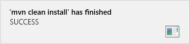

Notify
======

Note: This is an adaption of [Emmanuel Bernard's version](https://emmanuelbernard.com/blog/2015/03/26/being-notified-when-commands-end "Emmanuel Bernard: Get notified when terminal commands end") that works with Windows in addition to Mac and Linux.

Here is a tiny little tool that will speed up the multi-tasking life of terminal users: be notified when a command finishes.

How many times have you started a command in the terminal to realise that it will take a while? How many times did you then move to emails or twitter "in the mean time"? How many times have you forgotten about it and read our twitter feed for 30 minutes aka 25 minutes longer than the actual command?

Usage
=====

Credit
======

- David Gageot
- Sanne Grinovero
- Emmanuel Bernard
